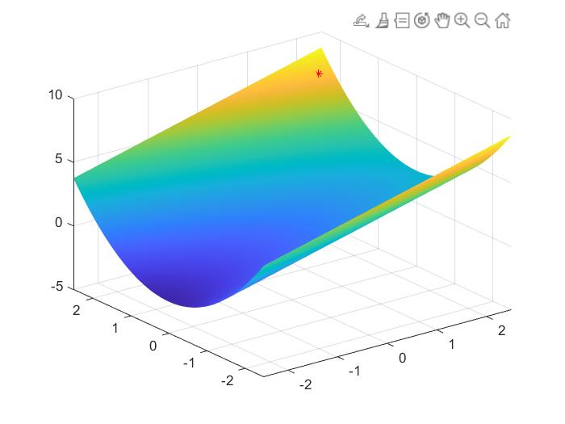
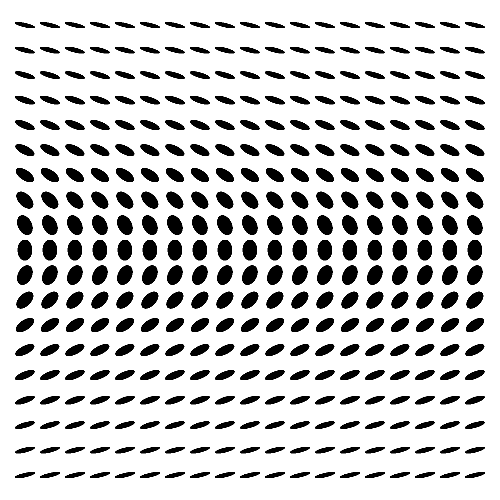
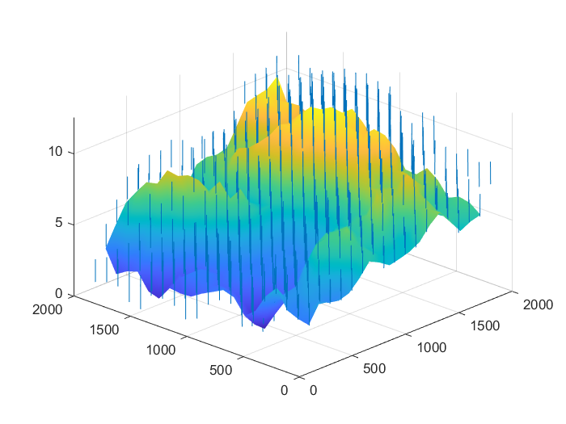

# Reconstruction 3D MonoVue

-Generation->
-Sft>
-Sfs->  
  

Projet realiser à l'ENSEEIHT sur la reconstruction 3D mono vue à partir de textons (ellipse) a partir de shade from texton et shading 

Presentation = [Click here](https://docs.google.com/presentation/d/1aVNoqoz0aDjyUjoWrCqfXS8aXDJRmCTfFYdGwxULujA/edit#slide=id.g10f852a8479_0_1281)