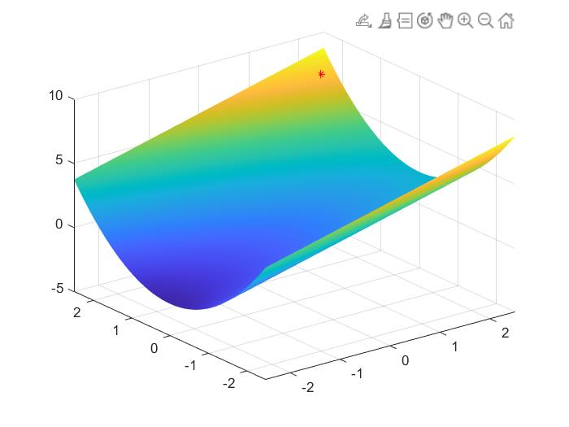
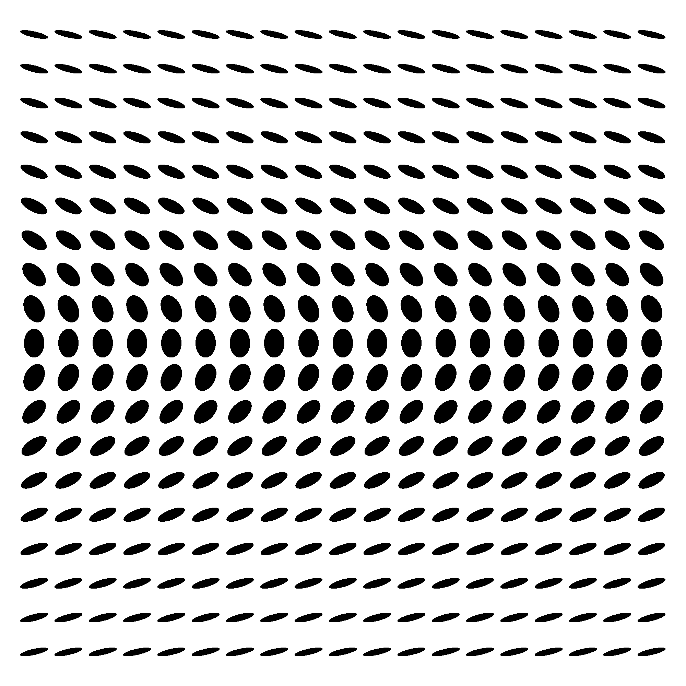
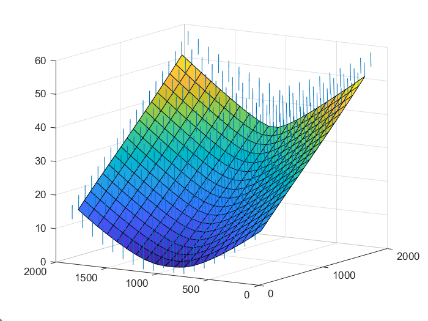

# Reconstruction 3D MonoVue

# Resultat
-Generation->
-Sft->
-Sfs->  

# Introduction
Projet realiser à l'ENSEEIHT sur la reconstruction 3D mono-vue à partir de Shade-from-texton et Shade-from-shading 

## Comment l'utiliser
- lancer le script bin/Gen/gen-image.m pour generer une image (format pgm dans bin/data)  
(normal du modele sauvegarder dans bin/data/data.mat)
- Compiler le makefile dans Sft/ELSD2/makefile (commande make)
  * lancer : `./elsd ../data/image.pgm`
- lancer /Sft/shape_from_texture.m (normales sauvegarder dans bin/data/normalSft.mat)
- lancer /Sft/sfs.m                
