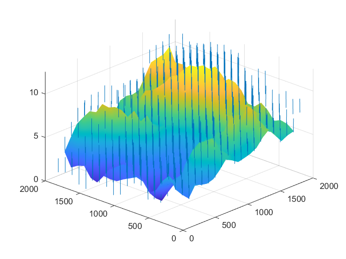

# Reconstruction 3D MonoVue

# Resultat
-Generation->
-Sft->
-Sfs->  

# Introduction
Projet realiser à l'ENSEEIHT sur la reconstruction 3D mono vue à partir de textons (ellipse) a partir de shade from texton et shading 

## Comment l'utiliser
- lancer le script generation_synthese/gen-image.m pour generer une image (Il faut la sauvegarder en PGM (portable Grayscale map))
- Compiler le makefile dans Sft/ELSD2/makefile (commande make)
- lancer /Sft/shape_from_texture.m
- lancer /Sft/sfs.m
